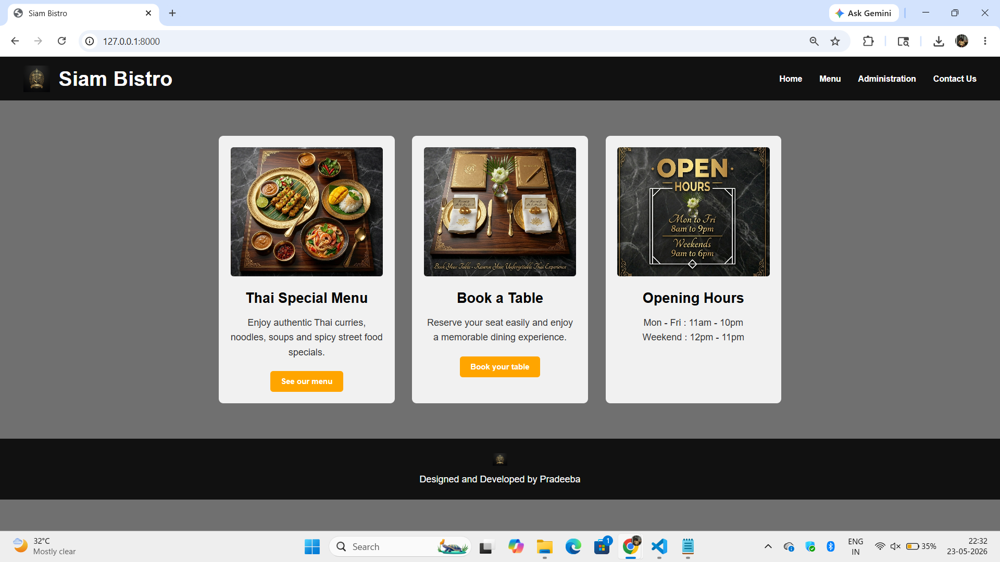
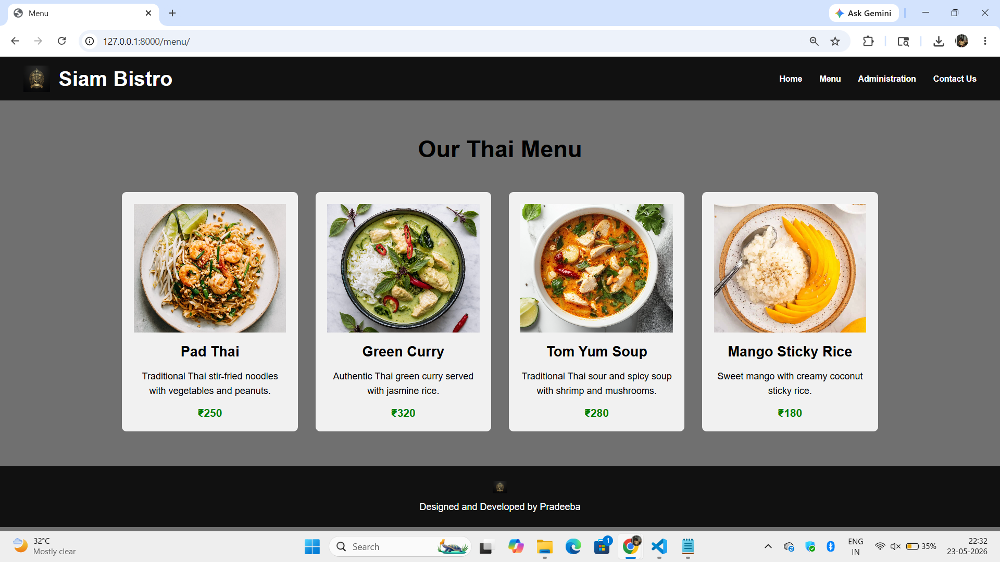
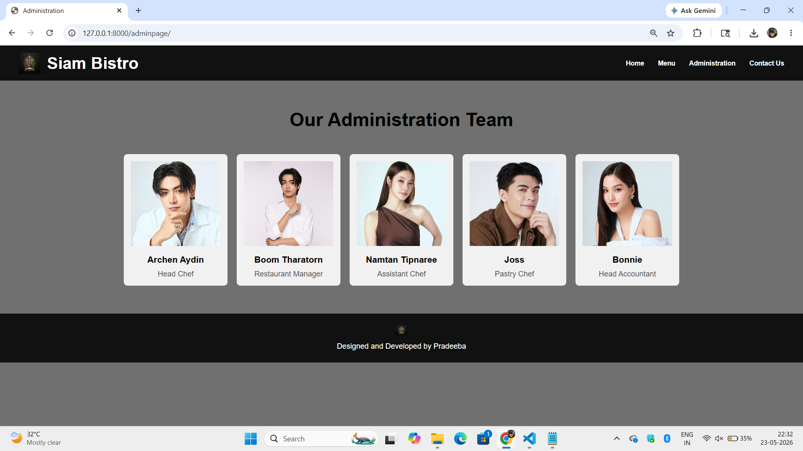
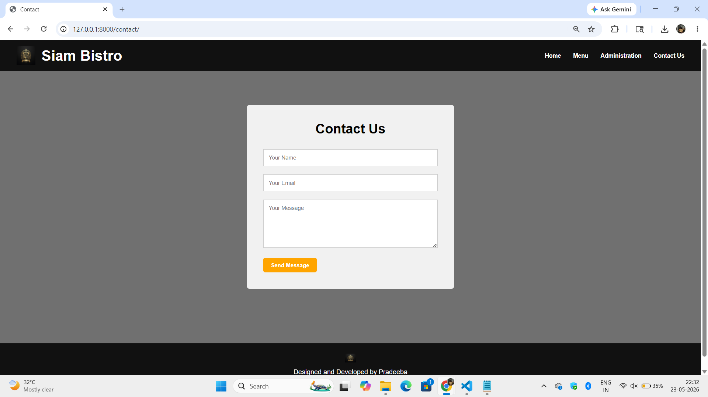

# Ex.06 Restuarant Website
## Date:

## AIM:
To develop a static Resturant website to display the menu and services provided by the resturant.

## DESIGN STEPS:

### Step 1:
Requirement collection.

### Step 2:
Creating the layout using HTML and CSS.

### Step 3:
Updating the sample content.

### Step 4:
Choose the appropriate style and color scheme.

### Step 5:
Validate the layout in various browsers.

### Step 6:
Validate the HTML code.

### Step 7:
Publish the website in the given URL.

## PROGRAM:
## index.html
```html

<!DOCTYPE html>
<html lang="en">
<head>
    <meta charset="UTF-8">
    <meta name="viewport" content="width=device-width, initial-scale=1.0">
    <title>Siam Bistro</title>

    <link rel="stylesheet" href="">
</head>

<body>

    <header>

        <div class="logo-section">
            
            <h1>Siam Bistro</h1>
        </div>

        <nav>
            <a href="/">Home</a>
            <a href="/menu/">Menu</a>
            <a href="/adminpage/">Administration</a>
            <a href="/contact/">Contact Us</a>
        </nav>

    </header>

    <section class="home-container">

        <div class="card">

            

            <h2>Thai Special Menu</h2>

            <p>
                Enjoy authentic Thai curries, noodles,
                soups and spicy street food specials.
            </p>

            <button>See our menu</button>

        </div>

        <div class="card">

            

            <h2>Book a Table</h2>

            <p>
                Reserve your seat easily and enjoy
                a memorable dining experience.
            </p>

            <button>Book your table</button>

        </div>

        <div class="card">

            

            <h2>Opening Hours</h2>

            <p>
                Mon - Fri : 11am - 10pm <br>
                Weekend : 12pm - 11pm
            </p>

        </div>

    </section>

    <footer>

        

        <p>Designed and Developed by Pradeeba</p>

    </footer>

</body>
</html>
```
## menu.html
```html

<!DOCTYPE html>
<html lang="en">
<head>
    <meta charset="UTF-8">
    <meta name="viewport" content="width=device-width, initial-scale=1.0">
    <title>Menu</title>

    <link rel="stylesheet" href="">
</head>

<body>

    <header>

        <div class="logo-section">
            
            <h1>Siam Bistro</h1>
        </div>

        <nav>
            <a href="/">Home</a>
            <a href="/menu/">Menu</a>
            <a href="/adminpage/">Administration</a>
            <a href="/contact/">Contact Us</a>
        </nav>

    </header>

    <section class="menu-section">

        <h1>Our Thai Menu</h1>

        <div class="menu-container">

            <div class="menu-card">

                

                <h2>Pad Thai</h2>

                <p>
                    Traditional Thai stir-fried noodles
                    with vegetables and peanuts.
                </p>

                <h3>₹250</h3>

            </div>

            <div class="menu-card">

                

                <h2>Green Curry</h2>

                <p>
                    Authentic Thai green curry
                    served with jasmine rice.
                </p>

                <h3>₹320</h3>

            </div>

            <div class="menu-card">

                

                <h2>Tom Yum Soup</h2>

                <p>
                    Traditional Thai sour and spicy soup
                    with shrimp and mushrooms.
                </p>

                <h3>₹280</h3>

            </div>

            <div class="menu-card">

                

                <h2>Mango Sticky Rice</h2>

                <p>
                    Sweet mango with creamy
                    coconut sticky rice.
                </p>

                <h3>₹180</h3>

            </div>

        </div>

    </section>

    <footer>

        

        <p>Designed and Developed by Pradeeba</p>

    </footer>

</body>
</html>
```
## admin.html
```html

<!DOCTYPE html>
<html lang="en">
<head>
    <meta charset="UTF-8">
    <meta name="viewport" content="width=device-width, initial-scale=1.0">
    <title>Administration</title>

    <link rel="stylesheet" href="">
</head>

<body>

    <header>

        <div class="logo-section">
            
            <h1>Siam Bistro</h1>
        </div>

        <nav>
            <a href="/">Home</a>
            <a href="/menu/">Menu</a>
            <a href="/adminpage/">Administration</a>
            <a href="/contact/">Contact Us</a>
        </nav>

    </header>

    <section class="admin-section">

        <h1>Our Administration Team</h1>

        <div class="admin-container">

            <div class="admin-card">
                
                <h3>Archen Aydin</h3>
                <p>Head Chef</p>
            </div>

            <div class="admin-card">
                
                <h3>Boom Tharatorn</h3>
                <p>Restaurant Manager</p>
            </div>

            <div class="admin-card">
                
                <h3>Namtan Tipnaree</h3>
                <p>Assistant Chef</p>
            </div>

            <div class="admin-card">
                
                <h3>Joss</h3>
                <p>Pastry Chef</p>
            </div>

            <div class="admin-card">
                
                <h3>Bonnie</h3>
                <p>Head Accountant</p>
            </div>

        </div>

    </section>

    <footer>

        

        <p>Designed and Developed by Pradeeba</p>

    </footer>

</body>
</html>

```
## contact.html
```html

<!DOCTYPE html>
<html lang="en">
<head>
    <meta charset="UTF-8">
    <meta name="viewport" content="width=device-width, initial-scale=1.0">
    <title>Contact</title>

    <link rel="stylesheet" href="">
</head>

<body>

    <header>

        <div class="logo-section">
            
            <h1>Siam Bistro</h1>
        </div>

        <nav>
            <a href="/">Home</a>
            <a href="/menu/">Menu</a>
            <a href="/adminpage/">Administration</a>
            <a href="/contact/">Contact Us</a>
        </nav>

    </header>

    <section class="contact-section">

        <div class="contact-box">

            <h1>Contact Us</h1>

            <form>

                <input type="text" placeholder="Your Name">

                <input type="email" placeholder="Your Email">

                <textarea rows="6" placeholder="Your Message"></textarea>

                <button type="submit">Send Message</button>

            </form>

        </div>

    </section>

    <footer>

        

        <p>Designed and Developed by Pradeeba</p>

    </footer>

</body>
</html>
```
## style.css
```css
*{
    margin:0;
    padding:0;
    box-sizing:border-box;
    font-family:Arial, Helvetica, sans-serif;
}

body{
    background:#707070;
}

/* HEADER */

header{
    width:100%;
    background:#111;
    display:flex;
    justify-content:space-between;
    align-items:center;
    padding:15px 40px;
}

.logo-section{
    display:flex;
    align-items:center;
    gap:15px;
}

.logo{
    width:45px;
    height:45px;
}

.logo-section h1{
    color:white;
    font-size:35px;
}

/* NAVIGATION */

nav a{
    color:white;
    text-decoration:none;
    margin-left:25px;
    font-weight:bold;
    font-size:14px;
}

nav a:hover{
    color:orange;
}

.active{
    color:orange;
}

/* HOME PAGE */

.home-container{
    width:90%;
    margin:60px auto;
    display:flex;
    justify-content:center;
    gap:30px;
    flex-wrap:wrap;
}

.card{
    width:300px;
    background:#f1f1f1;
    padding:20px;
    border-radius:8px;
    text-align:center;
}

.card img{
    width:100%;
    height:220px;
    object-fit:cover;
    border-radius:5px;
}

.card h2{
    margin-top:20px;
    margin-bottom:15px;
}

.card p{
    color:#333;
    line-height:25px;
    margin-bottom:20px;
}

button{
    background:orange;
    color:white;
    border:none;
    padding:10px 18px;
    border-radius:5px;
    cursor:pointer;
    font-weight:bold;
}

button:hover{
    background:#cc8400;
}

/* MENU PAGE */

.menu-section{
    width:90%;
    margin:60px auto;
    text-align:center;
}

.menu-section h1{
    margin-bottom:50px;
    font-size:40px;
}

.menu-container{
    display:flex;
    justify-content:center;
    gap:30px;
    flex-wrap:wrap;
}

.menu-card{
    width:300px;
    background:#f1f1f1;
    padding:20px;
    border-radius:8px;
}

.menu-card img{
    width:100%;
    height:220px;
    object-fit:cover;
}

.menu-card h2{
    margin-top:15px;
    margin-bottom:15px;
}

.menu-card p{
    line-height:25px;
    margin-bottom:15px;
}

.menu-card h3{
    color:green;
}

/* ADMIN PAGE */

.admin-section{
    width:90%;
    margin:60px auto;
    text-align:center;
}

.admin-section h1{
    margin-bottom:50px;
    font-size:40px;
}

.admin-container{
    display:flex;
    justify-content:center;
    gap:20px;
    flex-wrap:wrap;
}

.admin-card{
    width:220px;
    background:#f1f1f1;
    padding:15px;
    border-radius:8px;
}

.admin-card img{
    width:100%;
    height:180px;
    object-fit:cover;
}

.admin-card h3{
    margin-top:15px;
    margin-bottom:10px;
}

.admin-card p{
    color:#555;
}

/* CONTACT PAGE */

.contact-section{
    display:flex;
    justify-content:center;
    align-items:center;
    height:75vh;
}

.contact-box{
    width:500px;
    background:#f1f1f1;
    padding:40px;
    border-radius:8px;
}

.contact-box h1{
    text-align:center;
    margin-bottom:30px;
}

.contact-box input,
.contact-box textarea{
    width:100%;
    padding:12px;
    margin-bottom:20px;
    border:1px solid #ccc;
}

/* FOOTER */

footer{
    width:100%;
    background:#111;
    text-align:center;
    padding:25px;
    margin-top:50px;
}

.footer-logo{
    width:25px;
    margin-bottom:10px;
}

footer p{
    color:white;
}
```

## OUTPUT:









## RESULT:
The program for designing software company website using HTML and CSS is completed successfully.
